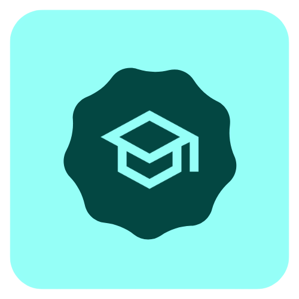

# DSBmaterial 🎓

<p align="center">
  
</p>

<p align="center">
  <strong>Material You Expressive alternative to the DSBmobile app</strong><br>
</p>

<div align="center">    
  <a href="https://github.com/WollyDev24/DSB_Material/LICENSE">
    </a>
  <a href="https://github.com/WollyDev24/DSB_Material/actions/workflows/build.yml">
    </a>
<!--  <a href="https://discord.gg/3x8qNWxgGZ">
    </a> -->
</div>

# ⬇️ Get DSBmaterial from here

<p align="left">
  <a href="https://apps.obtainium.imranr.dev/redirect?r=obtainium://add/https://github.com/WollyDev24/DSB_Material">
    </a>
  <a href="https://github.com/WollyDev24/DSB_Material/releases/latest">
    </a>
  <a href="https://fdroid.org">
    </a>
</p>

# 🛠️ Building the app from source:

- Clone the repo:
```bash
git clone https://github.com/WollyDev24/DSB_Material/
```

- open the folder in Android studio
- wait for gradle to sync
- build the app